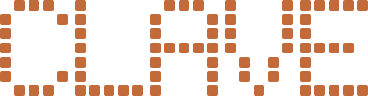
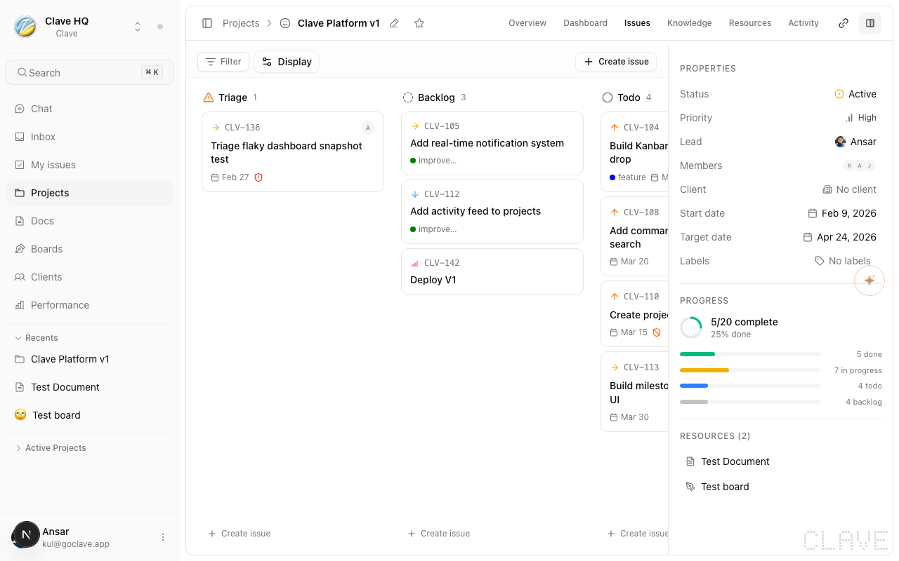
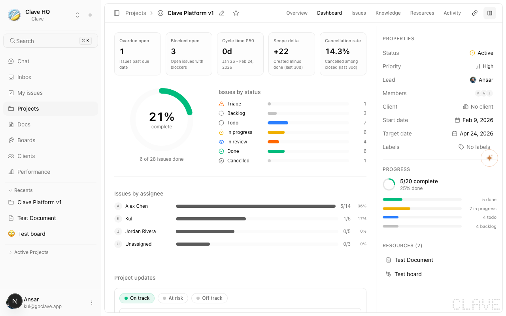
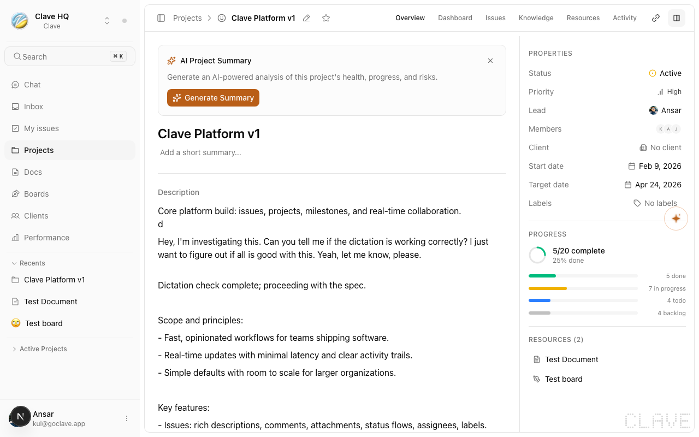
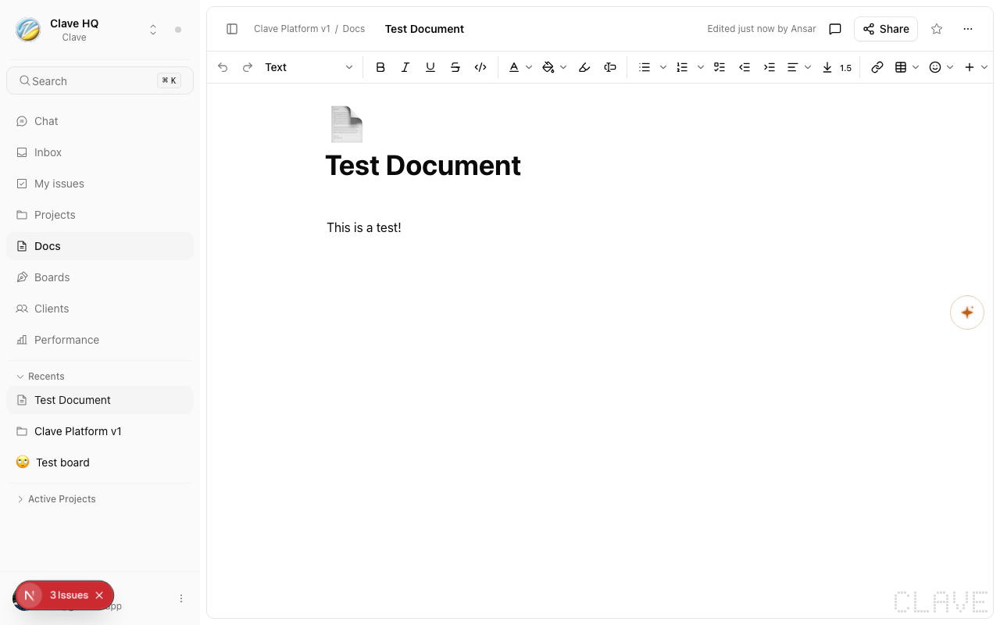
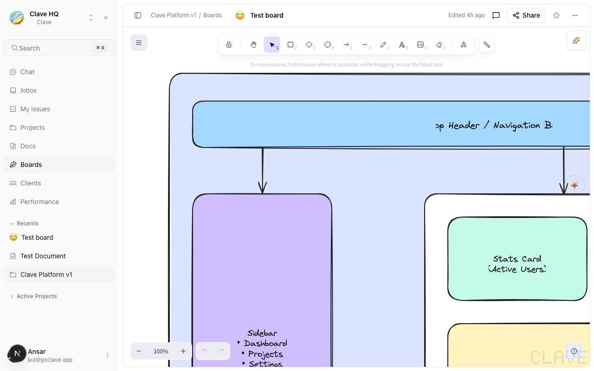
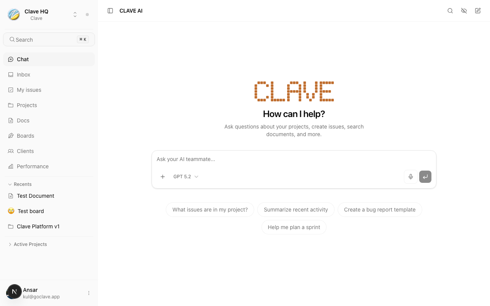
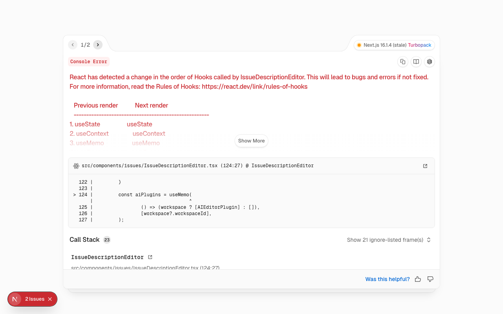
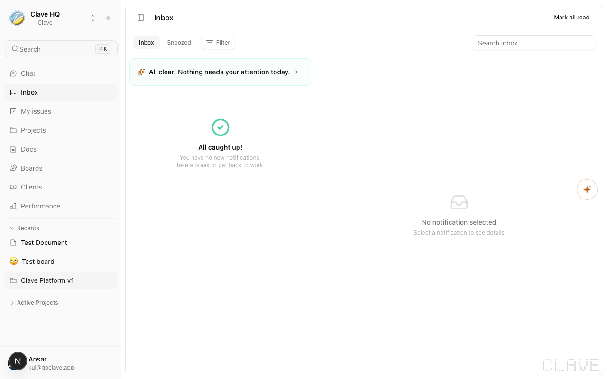
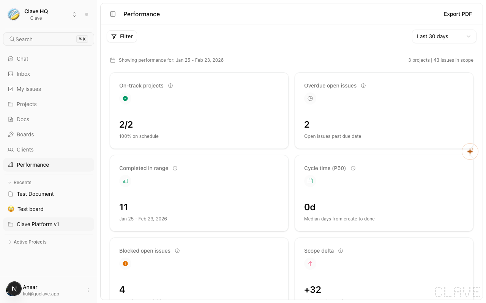

<p align="center">
  
</p>

<p align="center">
  <strong>Build in sync.</strong>
  <br />
  AI-native project management and collaboration platform.
  <br />
  <br />
  <a href="https://clave.z360.biz">Website</a>
  &middot;
  <a href="#local-setup">Setup</a>
  &middot;
  <a href="CONTRIBUTING.md">Contributing</a>
  &middot;
  <a href="SECURITY.md">Security</a>
</p>

<p align="center">
  <a href="LICENSE"></a>
</p>

---

Clave is a thinking workspace where AI operates as a first-class teammate — aware of your projects, issues, docs, and conversations. It combines Linear-style issue tracking, Notion-style documents, real-time whiteboards, and a deeply integrated AI agent layer — all in one workspace.

<br />

<p align="center">
  
</p>

## Features

### Issue Tracking

Track work across kanban boards, list views, and timeline views. Create sub-issues, define relations, assign labels, and let AI auto-triage incoming issues.

<p align="center">
  
  &nbsp;
  
</p>

### Sprint Planning

Plan sprints with an AI-powered sprint planner. Drag issues into sprints, track velocity, and manage your backlog.

<p align="center">
  
</p>

### Documents

Rich collaborative editor powered by Plate.js with real-time Yjs sync. Threaded comments, AI slash commands, and inline AI toolbar for rewrites and summaries.

<p align="center">
  
  &nbsp;
  
</p>

### Whiteboards

Real-time Excalidraw boards with AI diagram generation, comment pins overlay, and shared collaboration.

<p align="center">
  
  &nbsp;
  
</p>

### AI Chat

Streaming AI chat with 21+ workspace-aware tools, sub-agents, composable skills, RAG pipeline, and voice input. The AI understands your projects, issues, docs, and conversations.

<p align="center">
  
  &nbsp;
  
</p>

### And More

- **Projects** — milestones, team members, project updates, resource tracking
- **Notes** — lightweight block editor per workspace
- **Tasks** — personal task management with kanban view
- **Clients** — CRM with contacts linked to projects
- **Inbox** — unified notifications, @mentions, AI smart digest
- **Analytics** — workspace performance metrics and charts
- **GitHub Integration** — repo indexing, issue sync, webhooks
- **Billing** — Stripe-powered plans and subscriptions

<p align="center">
  
  &nbsp;
  
</p>

## Tech Stack

| Layer | Technology |
|-------|-----------|
| **Frontend** | Next.js 16, React 19, TypeScript (strict) |
| **Backend** | Convex — real-time queries, mutations, actions, workflows |
| **AI** | Vercel AI SDK v4, `@convex-dev/agent`, `@convex-dev/rag`, `@convex-dev/workflow` |
| **Editors** | Plate.js v52 (docs), Excalidraw (whiteboards), BlockNote (notes), TipTap (comments) |
| **UI** | Tailwind CSS 4, shadcn/ui, Radix UI, Lucide React |
| **Auth** | Convex Auth + Google OAuth |
| **Files** | UploadThing |
| **Billing** | Stripe |
| **Hosting** | Vercel (frontend) + Convex Cloud (backend) |
| **Runtime** | Bun |

## Local Setup

### Prerequisites

- [Bun](https://bun.sh) 1.1+
- [Node.js](https://nodejs.org) 20+
- A free [Convex](https://convex.dev) account

### 1. Clone and install

```bash
git clone https://github.com/AnsarUllahAnasZ360/Clave.git
cd Clave
bun install
```

### 2. Configure environment

```bash
cp .env.example .env.local
```

Convex will auto-populate the deployment values in the next step. No manual editing needed yet.

### 3. Start the dev server

```bash
bun run dev
```

This runs `npx convex dev` and Next.js together. On first run, Convex will prompt you to create a deployment and automatically write `CONVEX_DEPLOYMENT` and `NEXT_PUBLIC_CONVEX_URL` into your `.env.local`.

The app will be available at **http://localhost:4000**.

### 4. Sign in

**Quick start (no OAuth setup needed):**

Set `NEXT_PUBLIC_DEV_MODE=true` in `.env.local`, then visit `/dev-login` to sign in with a dev account.

**Google OAuth (production-like):**

1. Create OAuth credentials in [Google Cloud Console](https://console.cloud.google.com/apis/credentials)
2. Set the authorized redirect URI to: `https://<your-deployment>.convex.site/api/auth/callback/google`
3. Configure the credentials:

```bash
npx convex env set AUTH_GOOGLE_ID <your-client-id>
npx convex env set AUTH_GOOGLE_SECRET <your-client-secret>
```

### 5. Optional services

These are not required to run the app but enable additional features:

| Service | What it enables | Setup |
|---------|----------------|-------|
| [Azure OpenAI](https://azure.microsoft.com/en-us/products/ai-services/openai-service) | AI chat, agents, RAG, voice | `npx convex env set AZURE_RESOURCE_NAME ...` |
| [Resend](https://resend.com) | Email OTP, password reset | `npx convex env set AUTH_RESEND_KEY ...` |
| [UploadThing](https://uploadthing.com) | File uploads | `npx convex env set UPLOADTHING_TOKEN ...` |
| [Stripe](https://stripe.com) | Billing and subscriptions | `npx convex env set STRIPE_SECRET_KEY ...` |
| [GitHub OAuth](https://github.com/settings/developers) | Repo indexing, issue sync | Set in both `.env.local` and Convex env |

See [.env.example](.env.example) for the full list of configuration options and setup instructions.

## Development

```bash
bun run dev          # Dev server (Convex + Next.js) on port 4000
bun run dev:next     # Next.js only (split-terminal mode)
bun run dev:convex   # Convex only (split-terminal mode)
bun run build        # Production build
bun run lint         # Biome check (format + lint)
bun run lint:fix     # Biome autofix
bun run typecheck    # TypeScript type check
bun run test:unit    # Unit tests
bun run test:e2e     # Playwright E2E tests
bun run clean        # Kill stale processes + clear cache
bun run changeset    # Add changeset before merging
```

> **Port**: defaults to `4000`. Override with `DEV_PORT=3000 bun run dev`.
>
> **Troubleshooting**: `EADDRINUSE`, zombie processes, or stale cache? Run `bun run clean`.

## Project Structure

```
src/
├── app/
│   ├── [orgSlug]/[workspaceSlug]/   # Main app routes
│   ├── (auth)/                      # Sign-in, dev-login
│   ├── (marketing)/                 # Landing page
│   └── admin/                       # Admin panel
├── components/
│   ├── ai/                          # AI chat, sidebar, inline AI
│   ├── issues/                      # Issue tracking views
│   ├── projects/                    # Project dashboard, sprints
│   ├── documents/                   # Rich text editor
│   ├── whiteboards/                 # Whiteboard editor
│   └── ui/                          # shadcn/ui primitives
├── hooks/                           # Custom React hooks
└── lib/                             # Utilities

convex/
├── ai/                              # Chat, agents, RAG, tools, workflows
├── schema.ts                        # Database schema
└── *.ts                             # Domain functions

tests/
├── unit/                            # Vitest unit tests
├── integration/                     # Vitest integration tests
└── e2e/                             # Playwright E2E tests
```

## Deployment

Pull requests get automatic preview deployments (Convex + Vercel) with URLs posted as a PR comment.

Merges to `main` trigger production deployment via GitHub Actions:

1. **CI** — lint, typecheck, tests
2. **Convex** — deploy backend functions
3. **Vercel** — deploy frontend
4. **Release** — version bump and tag via [Changesets](https://github.com/changesets/changesets)

## Contributing

We welcome contributions. See [CONTRIBUTING.md](CONTRIBUTING.md) for setup instructions and guidelines.

## Security

To report a vulnerability, see [SECURITY.md](SECURITY.md). Please do not open a public issue for security concerns.

## License

[MIT](LICENSE)
